# Agent Architecture Diagram

## Hub-and-Spoke Overview

## Data Flow (Sequential)

```mermaid
flowchart LR
    subgraph P1["Phase 1"]
        C["Curator"] -->|dataset.jsonl\ncharacter_card.md| PQ1["Persona QA"]
    end

    subgraph P2["Phase 2"]
        D["Demo App"] -->|system prompt\nfrom character_card| Test["Test Chat"]
    end

    subgraph P3["Phase 3"]
        FT["Fine-tune"] -->|model outputs| PQ2["Persona QA"]
        PQ2 -->|approved| Export["GGUF Export"]
    end

    subgraph P4["Phase 4"]
        Deploy["Pi Deploy"] -->|llama.cpp\n+ systemd| Live["Live on Pi 5"]
    end

    PQ1 -->|"✅ gate pass"| D
    Test -->|"feedback"| FT
    Export -->|"model.gguf"| Deploy

    style P1 fill:#f5e6cc,stroke:#d4a843
    style P2 fill:#d4edda,stroke:#6db47e
    style P3 fill:#e8d5f5,stroke:#9b6dbf
    style P4 fill:#f8d7da,stroke:#d96b6b
```

## Agent Access Matrix

| Artifact | Orchestrator | Curator | Persona QA | Demo App | Fine-tune | Pi Deploy |
|----------|:-----------:|:-------:|:----------:|:--------:|:---------:|:---------:|
| `roadmap_status.yaml` | R/W | R | R | R | R | R |
| `mr_house_dataset.jsonl` | — | **W** | R | — | R | — |
| `character_card.md` | — | **W** | R | R | R | — |
| `persona_scores.csv` | R | — | **W** | — | R | — |
| `deploy_pi.md` | — | — | — | — | — | **W** |
