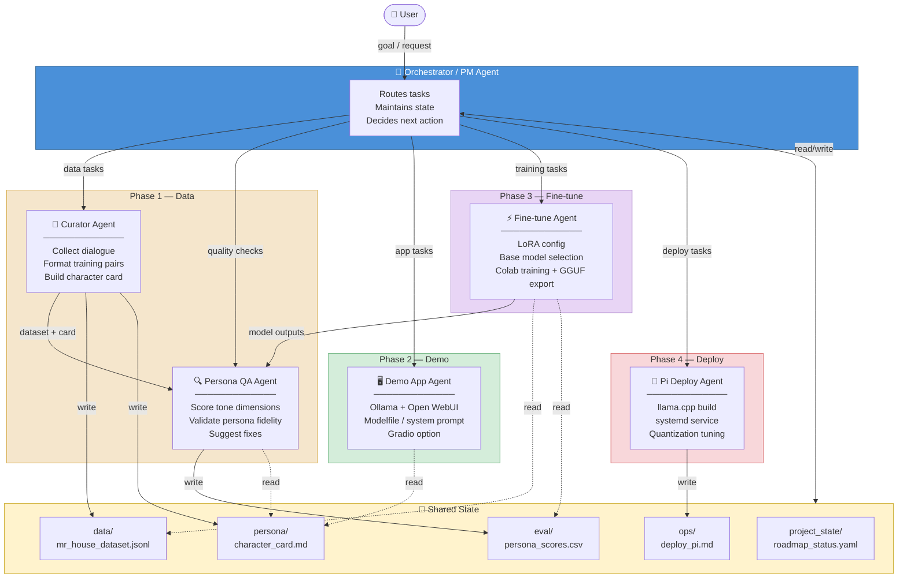
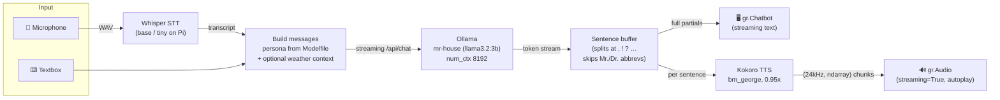

# Agent Architecture Diagram

## Hub-and-Spoke Overview

## Data Flow (Sequential)

```mermaid
flowchart LR
    subgraph P1["Phase 1"]
        C["Curator"] -->|dataset.jsonl\ncharacter_card.md| PQ1["Persona QA"]
    end

    subgraph P2["Phase 2"]
        D["Demo App"] -->|system prompt\nfrom character_card| Test["Test Chat"]
    end

    subgraph P3["Phase 3"]
        FT["Fine-tune"] -->|model outputs| PQ2["Persona QA"]
        PQ2 -->|approved| Export["GGUF Export"]
    end

    subgraph P4["Phase 4"]
        Deploy["Pi Deploy"] -->|llama.cpp\n+ systemd| Live["Live on Pi 5"]
    end

    PQ1 -->|"✅ gate pass"| D
    Test -->|"feedback"| FT
    Export -->|"model.gguf"| Deploy

    style P1 fill:#f5e6cc,stroke:#d4a843
    style P2 fill:#d4edda,stroke:#6db47e
    style P3 fill:#e8d5f5,stroke:#9b6dbf
    style P4 fill:#f8d7da,stroke:#d96b6b
```

## Demo Runtime — Chat & Voice Pipeline

Updated 2026-07-06 (latency + prompt quick fixes).

Key design points:

- **Single source of truth for the persona.** `demo/config.py` parses the
  `SYSTEM """..."""` block out of `demo/Modelfile` at startup and sends it as
  the request-level system message. This matters because Ollama *replaces* the
  Modelfile SYSTEM when a request carries its own system message — before this
  fix the demo silently ran on a 17-word stub prompt instead of the full persona.
- **Sentence-streaming TTS.** `voice.synthesize_chunk()` returns raw
  `(sample_rate, ndarray)` audio. `handlers._stream_reply()` watches the LLM
  token stream, cuts at sentence boundaries (with an abbreviation guard so
  "Mr. House" doesn't split), and synthesizes each sentence as soon as it is
  complete. Playback begins after the first sentence rather than after the
  whole response — the main latency fix.
- **Model preloading.** Whisper and Kokoro load in a background thread at app
  startup instead of lazily on the first voice turn.
- **Weather tool.** Keyword-triggered (`is_weather_query`); live wttr.in data is
  appended to the system prompt before the request. `resolve_location` always
  returns a target — an explicit "in <place>" (with trailing time words like
  "today" stripped, since wttr.in geocodes whatever it is handed), an
  in-universe alias (New Vegas / the Strip / the Mojave → Las Vegas), or Las
  Vegas by default. A failed lookup injects an explicit sensors-offline notice
  so the model reports the gap instead of inventing readings. Both injections
  restate their directive inline rather than relying on the Modelfile alone —
  at 3B the model otherwise leaks "the sensors you've provided" and fabricates
  numbers for uncovered locations. Parsing is covered by
  `scripts/test_weather.py`. Planned upgrade: native Ollama function calling.

## Agent Access Matrix

| Artifact | Orchestrator | Curator | Persona QA | Demo App | Fine-tune | Pi Deploy |
|----------|:-----------:|:-------:|:----------:|:--------:|:---------:|:---------:|
| `roadmap_status.yaml` | R/W | R | R | R | R | R |
| `mr_house_dataset.jsonl` | — | **W** | R | — | R | — |
| `character_card.md` | — | **W** | R | R | R | — |
| `persona_scores.csv` | R | — | **W** | — | R | — |
| `deploy_pi.md` | — | — | — | — | — | **W** |
